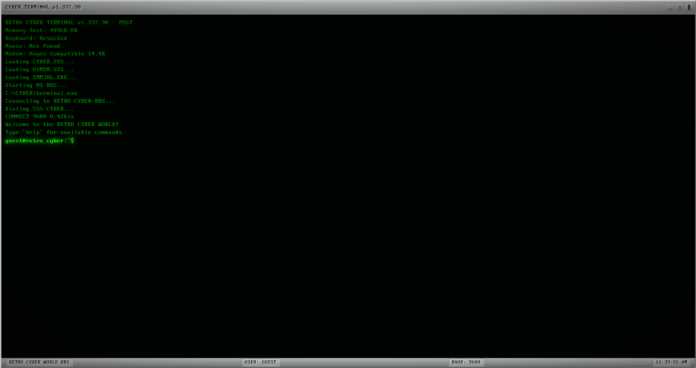

# 🌐 RETRO CYBER WORLD - Terminal Interface

> *Enter the digital realm where neon dreams and cyber nightmares collide*

## 🎯 Project Overview

A retro-cyberpunk terminal interface inspired by 1990s hacker culture, featuring neon aesthetics, glitch effects, and an interactive command-line experience. The project includes a hidden secret key discovery challenge that requires investigation and exploration.

## 🚀 Live Demo

[View Live Demo](https://retro-cyber-website.vercel.app/)
[View Live Video](https://drive.google.com/file/d/1PAZbcvaChRq_5q35RgIB6dEgCBC_ufVo/view?usp=sharing)

## ✨ Features

### 🎨 Visual Design
- **Neon Color Palette**: Electric green, cyber blue, magenta, purple
- **Retro Terminal UI**: Authentic 1990s command-line interface
- **Perfect DOS VGA 437 Font**: True DOS look and feel
- **Visual Effects**: 
  - Scanline CRT monitor simulation
  - Glitch animations and hover effects
  - Matrix-style background ambience
  - Blinking cursor and typing animations

### 💻 Interactive Terminal
- **Command System**: 15+ interactive commands with Unix-style functionality
- **Progressive Authentication**: Multi-tier access control system
- **Real-time Processing**: Live command execution and history
- **Easter Eggs**: Konami code integration and hidden shortcuts
- **Responsive Design**: Optimized for both desktop and mobile

### 🔍 Secret Key Challenge
- **Multi-step Discovery**: Progressive puzzle solving with clues hidden in terminal output, UI, and source code
- **Hidden Clues**: Scattered across different investigation methods (terminal, hover, source, console)
- **Investigation Required**: No obvious placement, requires exploration and deduction

## 🛠️ Technical Architecture

### Frontend Stack
- **React 18+**: Modern UI library with hooks
- **Vite**: Fast build tool and dev server
- **CSS3**: Advanced animations and effects
- **JavaScript ES6+**: Modern syntax and features

### Key Components
- `App.jsx`: Main terminal interface and command processor
- `App.css`: Cyberpunk styling and animations
- Command system with modular handlers
- Progressive secret discovery mechanism

## 📦 Installation & Setup

### Prerequisites
- Node.js 18+ and npm/yarn
- Modern web browser with ES6 support

### Quick Start
```bash
# Clone repository
git clone https://github.com/Akshith-cdr/retro-cyber-website.git
cd retro-cyber-website

# Install dependencies
npm install

# Start development server
npm run dev

# Build for production
npm run build
```

### Available Scripts
- `npm run dev` - Start development server
- `npm run build` - Build for production
- `npm run preview` - Preview production build

## 🎮 How to Use

### Basic Commands
```bash
help     # Show all available commands
about    # Display system information
whoami   # Show current user status
ls       # List directory contents
clear    # Clear terminal screen
finger   # User information lookup
login    # Authenticate as root (see hints)
```

### Advanced Features
```bash
netstat         # Display network connections
telnet [host] [port]   # Connect to remote BBS (after root access)
debug memory    # Dump memory contents (after root access)
debug trace     # System call trace (after root access)
cat [file]      # Read file contents (try /dev/hidden/vault)
echo [text]     # Display custom text or enter the master key
exit            # Terminate session
```

## 🕵️ Secret Key Discovery Guide

<details>
<summary>🔍 Click to reveal secret key methodology (SPOILERS)</summary>

### Discovery Method
The secret key challenge uses a **3-fragment system** requiring multiple investigation techniques:

#### Step 1: Terminal Investigation
- Run `finger root` for a password hint ("What do hackers drink at 3AM?")
- Use `login coffee` to authenticate as root
- Run `finger sysop` for a clue:  
  *"It's the kind of color that glows brightest in the dark, and defined the look of every cyberpunk cityscape."*  
  (Answer: **NEON**)

#### Step 2: Network & Source Clues
- Run `netstat` to find a suspicious connection on port 31337
- Use `telnet 127.0.0.1 31337` to connect to the BBS and reveal:  
  **FRAGMENT_BETA: The second key is 'MATRIX'**

#### Step 3: UI/Screen Clue
- After root login, hover over `USER: ROOT` in the status bar to reveal:  
  **31337** (FRAGMENT_GAMMA)
- (Clue in terminal: "The final fragment is hidden under your true identity on the screen.")

#### Final Assembly
- Combine all three fragments: `NEON-MATRIX-31337`
- Use `echo neon-matrix-31337` to unlock the master key and achievement

### Design Philosophy
- **Progressive Discovery**: Each step builds on the previous
- **Multiple Skills**: Tests terminal, UI, and source investigation
- **Logical Flow**: Clues lead naturally to next steps
- **Rewarding Experience**: Clear feedback and celebration

</details>

## 📸 Screenshots

### Main Terminal Interface


### Command Execution


### Secret Discovery


## 🎨 Design Inspiration

- **Cyberpunk 2077**: Futuristic terminal aesthetics
- **Hacker Culture (1990s)**: Authentic terminal feel
- **Tron Legacy**: Neon color schemes

## 🔧 Development Workflow

### Git Workflow
- Feature branches for new functionality
- Pull requests for code review
- Semantic commit messages
- Clean commit history

### Code Quality
- ESLint configuration for code standards
- Modern React patterns and hooks
- Responsive CSS design
- Performance optimizations

## 🚀 Deployment

### Build Process
```bash
npm run build
```

### Deployment Options
- **Vercel**: Zero-config deployment
- **Netlify**: Static site hosting
- **GitHub Pages**: Free hosting option

## 🎯 Future Enhancements

- [ ] Sound effects and audio feedback
- [ ] Additional terminal commands
- [ ] Multiple secret key challenges
- [ ] User accounts and progress saving
- [ ] Mobile-optimized touch interface
- [ ] Accessibility improvements (screen readers)

## 🤝 Contributing

1. Fork the repository
2. Create feature branch (`git checkout -b feature/amazing-feature`)
3. Commit changes (`git commit -m 'Add amazing feature'`)
4. Push to branch (`git push origin feature/amazing-feature`)
5. Open Pull Request

## 👨‍💻 Author

**Akshith Veerisetty**
- GitHub: [@Akshith-cdr](https://github.com/Akshith-cdr)
- LinkedIn: [Akshith Veerisetty](https://linkedin.com/in/akshith-veerisetty)

## 🙏 Acknowledgments

- Google Developer Groups for the challenge inspiration
- The cyberpunk and hacker culture communities
- Open source contributors and maintainers

---

*"Welcome to the digital realm, where neon dreams become reality. Happy hacking! 👾"*
